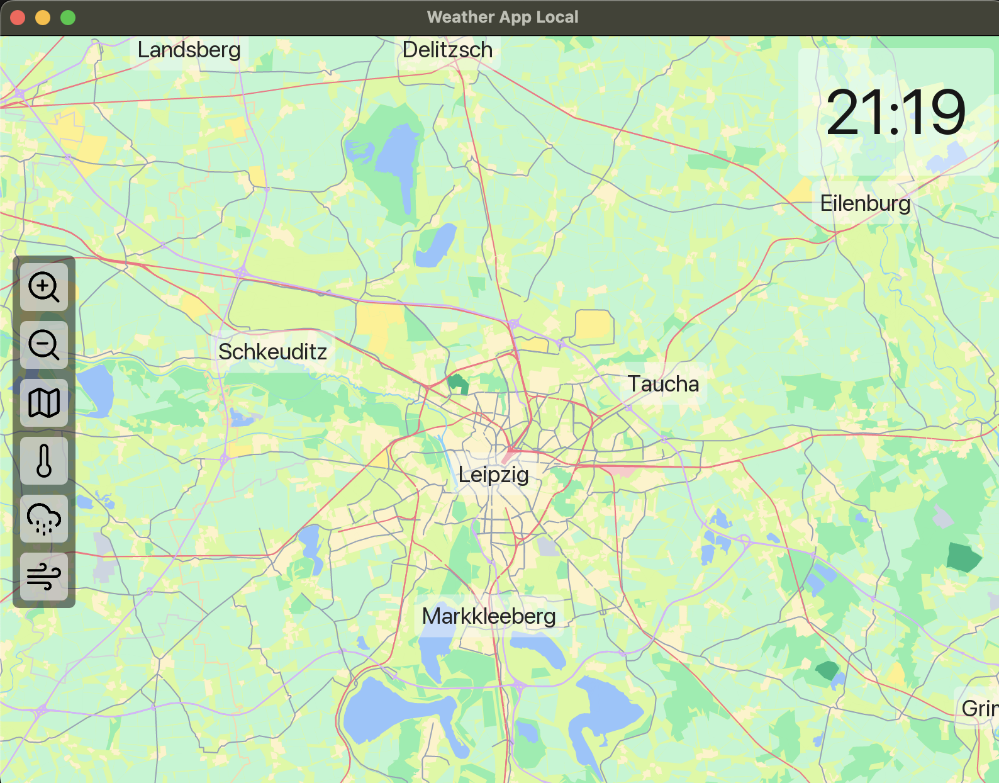
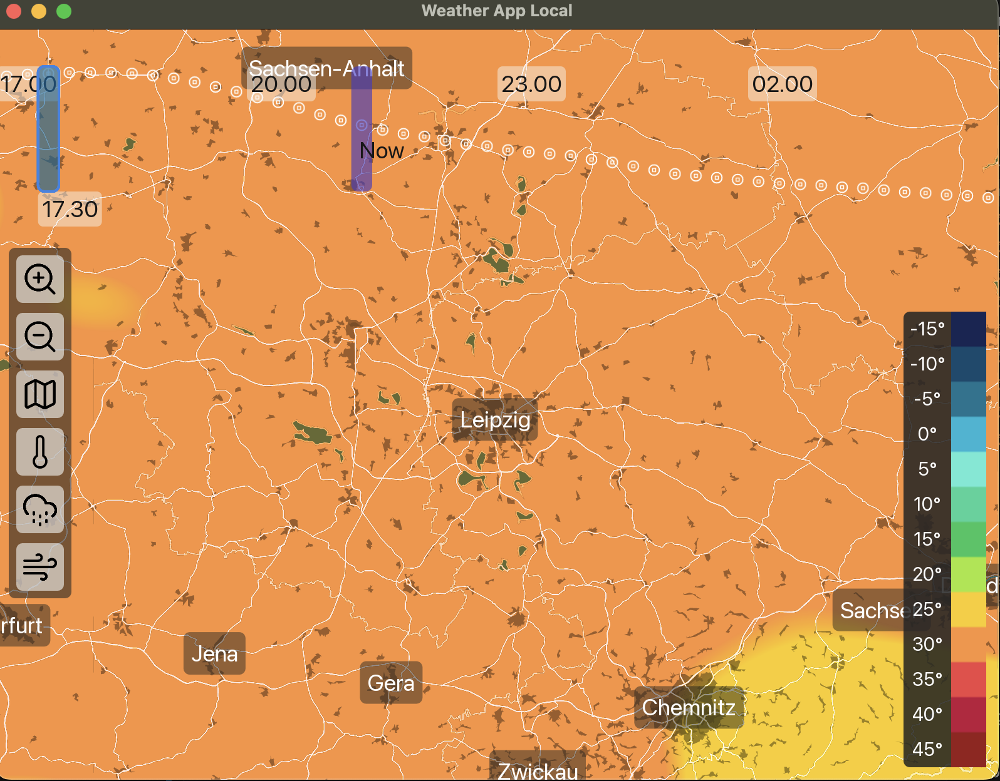
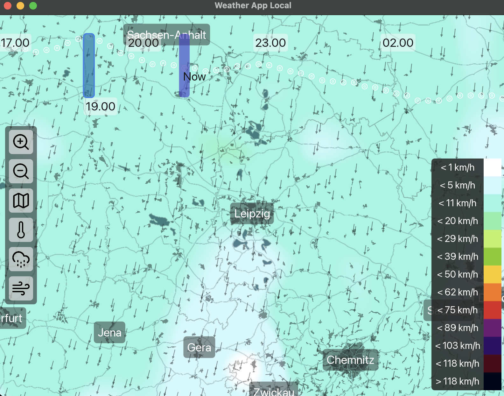
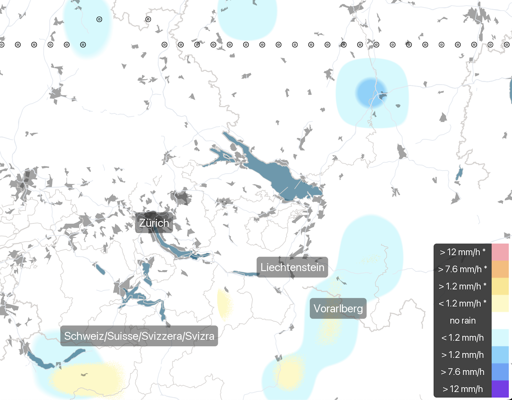

# Weather App Local
- visualize short term weather data (12 hours) for your current location

<table>
  <tr>
    <td></td>
    <td></td>
  </tr>
  <tr>
    <td></td>
      <td></td>
  </tr>
</table>

# Downloads
- for windows, macos and linux there are automaticly build releases [here](https://github.com/nat3Github/weather-app-local/releases) for testing the app
- these are build with a privat api key which can get exhausted as too many users use the auto releases
- if this troubles you please consider getting your own api key from maptiler and [build from source](#Building-from-source)
- on macos, first make the app executable by running `chmod +x Weather-App-Local` in a terminal, you need to allow the app to run in your settings, after that you can use it normally

# Building from source
- a maptiler api key is needed for building
- create a file named `.env` under `src/lib` with contents maptiler_api_key = "use_your_maptiler_api_key_here"
- a maptiler api key can be obtained by creating an account on [maptiler](https://cloud.maptiler.com/auth/widget?next=https://cloud.maptiler.com/maps/)

- install zig 0.14.1 from  [ziglang](https://ziglang.org/download/)
- clone this repository
- navigate into the repository
- run `zig build release` to make an release build for you current platform
- binary is in the zig-out folder
