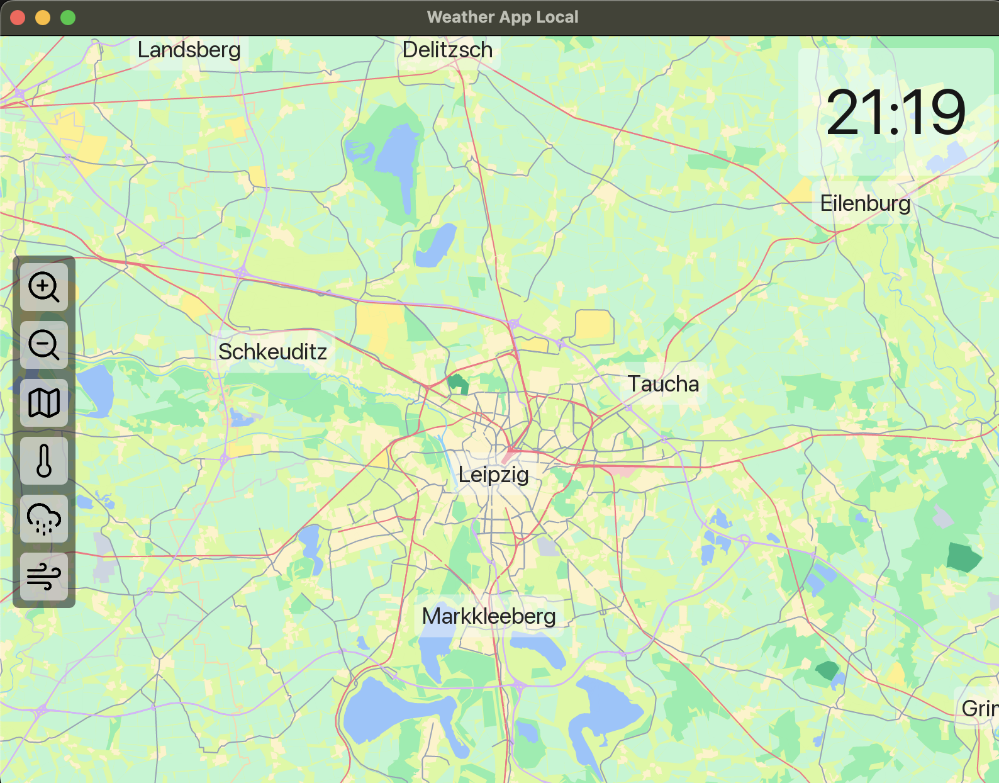
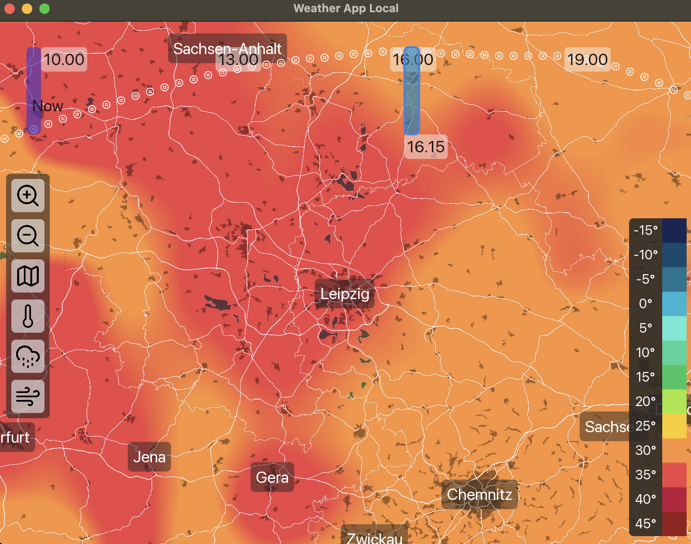
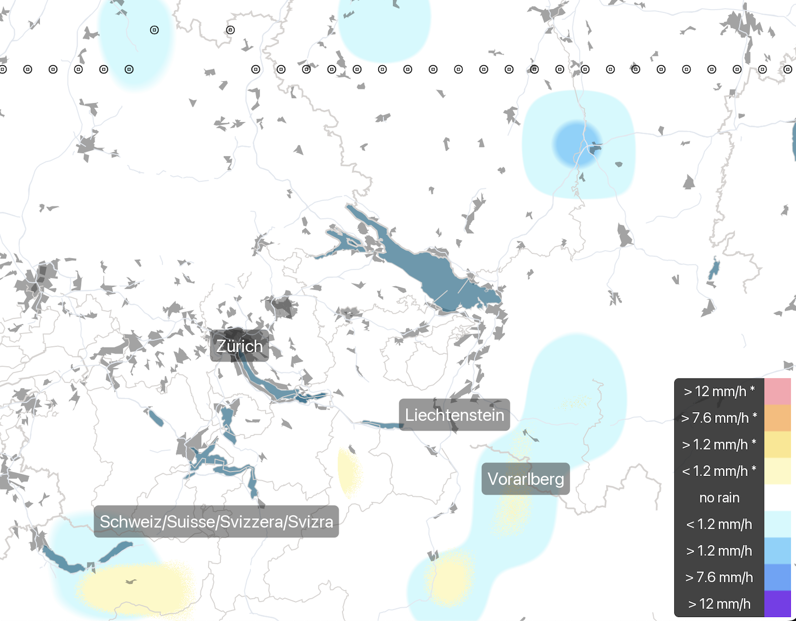

# Weather App Local

- visualize short term weather data (12 hours) for your current location

<table>
  <tr>
    <td></td>
    <td></td>
  </tr>
  <tr>
    <td></td>
      <td></td>
  </tr>
</table>

# Downloads

- for windows, macos and linux there are automaticly build releases for the latest tagged versions [here](https://github.com/nat3Github/weather-app-local/releases), feel free to use those for testing the app
- these are build with a privat api key which can get exhausted as too many users use the auto releases
- if this troubles you please consider getting your own api key from maptiler and [build from source](#Building-from-source)

# Usage Notes

- on macos, first make the app executable by running `chmod +x Weather-App-Local` in a terminal, you need to allow the app to run in your settings, after that you can use it normally
- on windows you can run the .exe but you need to manually allow it to run when you launch it
- note: i could not test the linux release since i dont own a linux system for now
- an active internet connection is needed when running the app
- the visualizations are generated on the fly, so it probably wont run very smoothly on weak hardware

# Keybindings

- `N` next Datapoint
- `Shift + N` previous Datapoint
- `T` for Temperature View
- `R` for Rain View
- `W` for Wind View
- `J` for Zooming out
- `K` for Zooming in

# Building from source

- a maptiler api key is needed for building
- create a file named `.env` under `src/lib` with contents `maptiler_api_key = "use_your_maptiler_api_key_here"`
- a maptiler api key can be obtained by creating an account on [maptiler](https://cloud.maptiler.com/auth/widget?next=https://cloud.maptiler.com/maps/)

- install zig 0.14.1 from [ziglang](https://ziglang.org/download/) (and add it to the PATH so it can be called in the terminal)
- download/clone this repository
- navigate into the repository
- run `zig build release` to make an release build for you current Operating System (Windows, MacOs, Linux)
- the output binary is in the zig-out folder

# Related libraries

- GUI framework: [dvui](https://github.com/david-vanderson/dvui)
- Map rendering: [osmr](https://github.com/nat3Github/zig-lib-osmr)
- Painting: [z2d](https://github.com/vancluever/z2d)
- Icons: [icons](https://github.com/nat3Github/zig-lib-icons)
- ... and a lot more, thank you!
